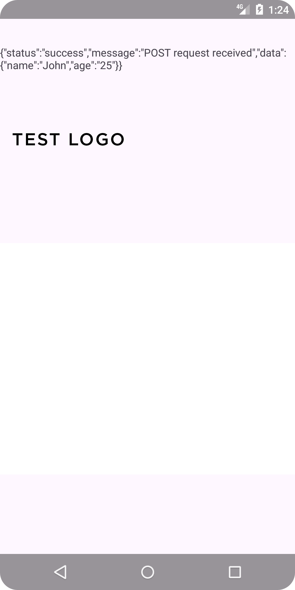

# Android-API-Communication-Without-AES-Encryption
Its communicate with PHP, MySQL server using custom HTTP cURL request. Its work on free all kind of PHP, MySQL hosting servers. Generally, Its bypass the client side AES encryption for API communication. Its easy to Implement and light code provide.

## Steps to follow:
 - Add Internet permission on 'AndroidMainfest.xml' and change application tag to 'android:name=".GlobalResourch"' and also add 'android:usesCleartextTraffic="true"' on this application tag.
      </br>
   ```
    <uses-permission android:name="android.permission.INTERNET"/>
    <uses-permission android:name="android.permission.ACCESS_NETWORK_STATE"/>
    <uses-permission android:name="android.permission.ACCESS_WIFI_STATE"/>
    <uses-permission android:name="android.permission.CHANGE_NETWORK_STATE"/>
   
       <application
        android:name=".GlobalResourch"
        android:usesCleartextTraffic="true">

   
   ```
 - Create a java class 'GlobalResourch' for globaly sharing data like (User agent, cookie, accept).
      </br>
   ```
    package com.nazmulalam.curltest;
      
      import android.app.Application;
      
      public class GlobalResourch extends Application {
      
          private String agent;
          private String token;
      
      
          @Override
          public void onCreate() {
              super.onCreate();
              // Initialize any global variables here
              agent = "default value";
              token = "default value";
          }
      
      
          public String getToken() {
              return token;
          }
      
          public void setToken(String token) {
              this.token = token;
          }
      
          public String getAgent() {
              return agent;
          }
      
          public void setAgent(String agent) {
              this.agent = agent;
          }
      }
   ```
 
 - Create a java class 'HttpHelper' on 'app->java->your_package_name->HttpHelper'
   </br>
   ```
   package com.nazmulalam.curltest;
    
    import static android.content.Context.MODE_PRIVATE;
    
    import static androidx.core.content.ContentProviderCompat.requireContext;
    
    import android.content.Context;
    import android.content.SharedPreferences;
    import android.util.Log;
    
    import java.io.BufferedReader;
    import java.io.DataOutputStream;
    import java.io.InputStreamReader;
    import java.net.HttpURLConnection;
    import java.net.URL;
    
    import javax.net.ssl.HostnameVerifier;
    import javax.net.ssl.HttpsURLConnection;
    import javax.net.ssl.SSLContext;
    import javax.net.ssl.TrustManager;
    import javax.net.ssl.X509TrustManager;
    
    public class HttpHelper {
    
    
        public static String getRequest(Context context, String urlString, String postDataString) {
    
    //        SharedPreferences sharedPreferences = context.getSharedPreferences("CurlApp", Context.MODE_PRIVATE);
    //        String token = sharedPreferences.getString("token", "default_value");
    //        String agent = sharedPreferences.getString("agent", "default_value");
           GlobalResourch glo = (GlobalResourch) context.getApplicationContext();
            String token = glo.getToken();
            String agent = glo.getAgent();

       Log.d("HTTPHELPER12", token + "AGENT:"+ agent);

        HttpURLConnection connection = null;
        try {

            if(isHttps(urlString)){

                // Set up SSL to bypass certificate validation (equivalent to cURL --insecure)
                TrustManager[] trustAllCerts = new TrustManager[]{
                        new X509TrustManager() {
                            public java.security.cert.X509Certificate[] getAcceptedIssuers() {
                                return null;
                            }

                            public void checkClientTrusted(java.security.cert.X509Certificate[] certs, String authType) {
                            }

                            public void checkServerTrusted(java.security.cert.X509Certificate[] certs, String authType) {
                            }
                        }
                };

                // Install the all-trusting trust manager
                SSLContext sslContext = SSLContext.getInstance("TLS");
                sslContext.init(null, trustAllCerts, new java.security.SecureRandom());
                HttpsURLConnection.setDefaultSSLSocketFactory(sslContext.getSocketFactory());

                // Create a hostname verifier that doesn't verify the hostname
                HostnameVerifier allHostsValid = (hostname, session) -> true;
                HttpsURLConnection.setDefaultHostnameVerifier(allHostsValid);
            }

            // Create a URL object
            URL url = new URL(urlString);
            // Open the connection
            connection = (HttpURLConnection) url.openConnection();


            // Set headers
            connection.setRequestProperty("Accept", "text/html,application/xhtml+xml,application/xml;q=0.9,image/avif,image/webp,image/apng,*/*;q=0.8,application/signed-exchange;v=b3;q=0.7");

            connection.setRequestProperty("Cookie", "__test="+token);
          //  connection.setRequestProperty("Upgrade-Insecure-Requests", "1");
            connection.setRequestProperty("User-Agent", agent);


            // If postDataString is null, it's a GET request; otherwise, it's a POST request
            if (postDataString == null || postDataString.isEmpty()) {
                connection.setRequestMethod("GET");
            } else {
                connection.setRequestMethod("POST");
                connection.setDoOutput(true);  // Indicates POST request

                // Send POST data
                DataOutputStream outputStream = new DataOutputStream(connection.getOutputStream());
                outputStream.writeBytes(postDataString);
                outputStream.flush();
                outputStream.close();
                Log.d("HTTPHELPER", "Method POST");
            }

            // Get response code
            int responseCode = connection.getResponseCode();
            if (responseCode == HttpURLConnection.HTTP_OK) { // Success
                BufferedReader in = new BufferedReader(new InputStreamReader(connection.getInputStream()));
                String inputLine;
                StringBuilder response = new StringBuilder();

                // Read the response
                while ((inputLine = in.readLine()) != null) {
                    response.append(inputLine);
                }
                in.close();

                // Return the response as a string
                return response.toString();
            } else {
                return "Error: " + responseCode;
            }
        } catch (Exception e) {
            e.printStackTrace();
            return "Exception: " + e.getMessage();
        } finally {
            if (connection != null) {
                connection.disconnect();
            }
        }
    }

        // Method to check if the URL uses HTTPS
        public static boolean isHttps(String url) {
            return url.toLowerCase().startsWith("https://");
        }

        // Method to check if the URL uses HTTP
        public static boolean isHttp(String url) {
            return url.toLowerCase().startsWith("http://");
        }

      }
   ```

 - Create a another java class 'HttpImageHelper' for handle image request and processing it to Bitmap image for easily use any ImageView to show this image.
   <br/>
   ```
     package com.nazmulalam.curltest;

    import android.content.Context;
    import android.content.SharedPreferences;
    import android.graphics.Bitmap;
    import android.graphics.BitmapFactory;
    import android.util.Log;
    
    import java.io.BufferedInputStream;
    import java.io.FileOutputStream;
    import java.io.InputStream;
    import java.net.HttpURLConnection;
    import java.net.URL;
    import java.security.SecureRandom;
    import java.security.cert.X509Certificate;
    
    import javax.net.ssl.HostnameVerifier;
    import javax.net.ssl.HttpsURLConnection;
    import javax.net.ssl.SSLContext;
    import javax.net.ssl.TrustManager;
    import javax.net.ssl.X509TrustManager;
    
    public class HttpImageHelper {

    public static Bitmap fetchImage(Context context, String urlString, String saveFilePath){
        SharedPreferences sharedPreferences = context.getSharedPreferences("CurlApp", Context.MODE_PRIVATE);
        String token = sharedPreferences.getString("token", "default_value");
        String agent = sharedPreferences.getString("agent", "default_value");

        HttpURLConnection connection = null;
        InputStream inputStream = null;
        FileOutputStream fileOutputStream = null;
        Bitmap image = null;
        try {

            // Set up SSL to bypass certificate validation (equivalent to cURL --insecure)
            TrustManager[] trustAllCerts = new TrustManager[]{
                    new X509TrustManager() {
                        public X509Certificate[] getAcceptedIssuers() {
                            return null;
                        }

                        public void checkClientTrusted(X509Certificate[] certs, String authType) {
                        }

                        public void checkServerTrusted(X509Certificate[] certs, String authType) {
                        }
                    }
            };

            // Install the all-trusting trust manager
            SSLContext sslContext = SSLContext.getInstance("TLS");
            sslContext.init(null, trustAllCerts, new SecureRandom());
            HttpsURLConnection.setDefaultSSLSocketFactory(sslContext.getSocketFactory());

            // Create a hostname verifier that doesn't verify the hostname
            HostnameVerifier allHostsValid = (hostname, session) -> true;
            HttpsURLConnection.setDefaultHostnameVerifier(allHostsValid);


            // Create URL object
            URL url = new URL(urlString);

            // Open connection
            connection = (HttpURLConnection) url.openConnection();

            // Set request method to GET
            connection.setRequestMethod("GET");

            // Set the required headers (including User-Agent)
            connection.setRequestProperty("Accept", "text/html,application/xhtml+xml,application/xml;q=0.9,image/avif,image/webp,image/apng,*/*;q=0.8,application/signed-exchange;v=b3;q=0.7");
            // connection.setRequestProperty("Accept-Language", "en-US,en;q=0.9,bn;q=0.8");
            // connection.setRequestProperty("Connection", "keep-alive");
            connection.setRequestProperty("Cookie", "__test="+token); // Add your cookie here
            //  connection.setRequestProperty("Sec-Fetch-Dest", "document");
            //   connection.setRequestProperty("Sec-Fetch-Mode", "navigate");
            //   connection.setRequestProperty("Sec-Fetch-Site", "none");
            // connection.setRequestProperty("Sec-Fetch-User", "?1");
            connection.setRequestProperty("Upgrade-Insecure-Requests", "1");
            connection.setRequestProperty("User-Agent", agent);
            //   connection.setRequestProperty("sec-ch-ua", "\"Google Chrome\";v=\"129\", \"Not=A?Brand\";v=\"8\", \"Chromium\";v=\"129\"");
            // connection.setRequestProperty("sec-ch-ua-mobile", "?0");
            //  connection.setRequestProperty("sec-ch-ua-platform", "\"Windows\"");

            // Get response code
            int responseCode = connection.getResponseCode();
            if (responseCode == HttpURLConnection.HTTP_OK) { // Success

                // Open input stream to read image data
                inputStream = new BufferedInputStream(connection.getInputStream());
                Log.d("ACCD","SUCCESS" + inputStream.toString());
                image = BitmapFactory.decodeStream(inputStream);
                // Open output stream to save the image
                //  fileOutputStream = new FileOutputStream(saveFilePath);

                // Buffer for image data
    //                    byte[] buffer = new byte[1024];
    //                    int bytesRead;
    //                    while ((bytesRead = inputStream.read(buffer)) != -1) {
    //                        fileOutputStream.write(buffer, 0, bytesRead);
    //                    }
    
                    // Post success message to the main thread (UI update)
    
    //                handler.post(() ->{
    //                    imageView.setImageBitmap(image);
    //                    Log.d("ACCD","SUCCESS");
    //
    //                });

            } else {
                // Post failure message to the main thread (UI update)
             //   handler.post(() ->  Log.d("ACCD","Faield" + responseCode));
            }

        } catch (Exception e) {
            // Handle the exception
            e.printStackTrace();
          //  handler.post(() ->  Log.d("ACCD","error"+ e.getMessage()));

        } finally {
            try {
                if (inputStream != null) inputStream.close();
                if (fileOutputStream != null) fileOutputStream.close();
                if (connection != null) connection.disconnect();
            } catch (Exception ex) {
                ex.printStackTrace();
            }
        }

        return image;
    }
    }
   ```
 - When Implement it on any Activity firstly create 'SingleThreadExecutor' and 'Handler(Looper.getMainLooper())' and create context object of GlobalResourch like that 'GlobalResourch global = (GlobalResourch)getApplicationContext();' after 'setContentView'.
   <br/>
   ```
     public class MainActivity extends AppCompatActivity {
    // Create a background thread executor
    private static final ExecutorService executor = Executors.newSingleThreadExecutor();
    // Create a handler for the main thread
    private static final Handler handler = new Handler(Looper.getMainLooper());

   @SuppressLint("MissingInflatedId")
      @Override
      protected void onCreate(Bundle savedInstanceState) {
          super.onCreate(savedInstanceState);
          EdgeToEdge.enable(this);
          setContentView(R.layout.activity_main);
          GlobalResourch global = (GlobalResourch)getApplicationContext();
   ```
 - Then load a website or API domain on webview for extracting a user-agent and cookie and set it to GlobalResourch variable.
   ```

  
          //inside onCreate function

         WebView wed = findViewById(R.id.wed); 
          wed.getSettings().setJavaScriptEnabled(true);
                wed.setWebViewClient(new WebViewClient(){

            @RequiresApi(api = Build.VERSION_CODES.LOLLIPOP)
            @Override
            public WebResourceResponse shouldInterceptRequest(WebView view, WebResourceRequest request) {
                // Capture request headers
                Map<String, String> requestHeaders = request.getRequestHeaders();

                // Get the User-Agent header
                String userAgent = requestHeaders.get("User-Agent");
                if (userAgent != null) {
                    Log.d("User-Agent", "User-Agent: " + userAgent);
                   global.setAgent(userAgent);
                   // SharedPreferences.Editor editor = sharedPreferences.edit();
                 //   editor.putString("agent", userAgent);
                 //   editor.apply();
                } else {
                    Log.d("User-Agent", "User-Agent header not found");
                }

                // Continue loading the request
                // If you need to modify headers or return a custom response, you can do so here.
                return super.shouldInterceptRequest(view, request);
            }
            @Override
            public void onPageFinished(WebView view, String url) {
                super.onPageFinished(view, url);
                // Access cookies
                Log.d("PageFinished", "Page loaded: " + url);

                String cookies = CookieManager.getInstance().getCookie(url);
                Log.d("Cookies", "All the cookies for this URL: " + cookies);

                // Check if __test cookie exists
                if (cookies != null && cookies.contains("__test")) {
                    // You can now work with the __test cookie value
                    String testCookie = extractTestCookie(cookies);
                    Log.d("TestCookie", "__test cookie value: " + testCookie);

                    global.setToken(testCookie);
                  //  Log.d("HTTPHELPER12", "FromMain"+global.getToken());
        //                    SharedPreferences.Editor editor = sharedPreferences.edit();
        //                    editor.putString("token", testCookie);
        //                    editor.apply();

                    fetchData(); //call your custom fetch function or API
                }
            }

            // Extract the __test cookie value from the cookie string
            private String extractTestCookie(String cookies) {
                String[] cookieArray = cookies.split(";");
                for (String cookie : cookieArray) {
                    if (cookie.trim().startsWith("__test=")) {
                        return cookie.split("=")[1];
                    }
                }
                return null;
            }
        });

        wed.loadUrl("http://nazmulalamshuvo.42web.io/eijagarbackup/curl/");
        // Send the HTTP GET request
        // Example URL (replace with the URL you provided) 
   ```
 - Now, 'fetchData()' can fetch data or image with your API url.
    <br/>
   ```
        // outside of onCreate function

        private void fetchData() {
        
        //        // Example usage of the helper method
                String url = "https://nazmulalamshuvo.42web.io/eijagarbackup/curl/api.php";
                String postData = "name=John&age=25";  // Post data can be null for GET requests

        executor.execute(() -> {
            // Use the helper class method to get a response from the server

            String jsonResponse = HttpHelper.getRequest(this, url, postData); // Can pass null for GET request

            // Post the result back to the main thread to update the UI
            handler.post(() -> {
                responseTextView.setText(jsonResponse);
                Log.d("HTTPHELPER", jsonResponse);
            });
        });

        String imageUrl = "https://nazmulalamshuvo.42web.io/eijagarbackup/sla/logo.png";
        executor.execute(() -> {

            Bitmap image = HttpImageHelper.fetchImage(this, imageUrl, "null");
            handler.post(() -> {
                imageView.setImageBitmap(image);
                Log.d("RETURNIMG", "Image set");
            });
        });

        } 
   ```
   


### Output on device:

